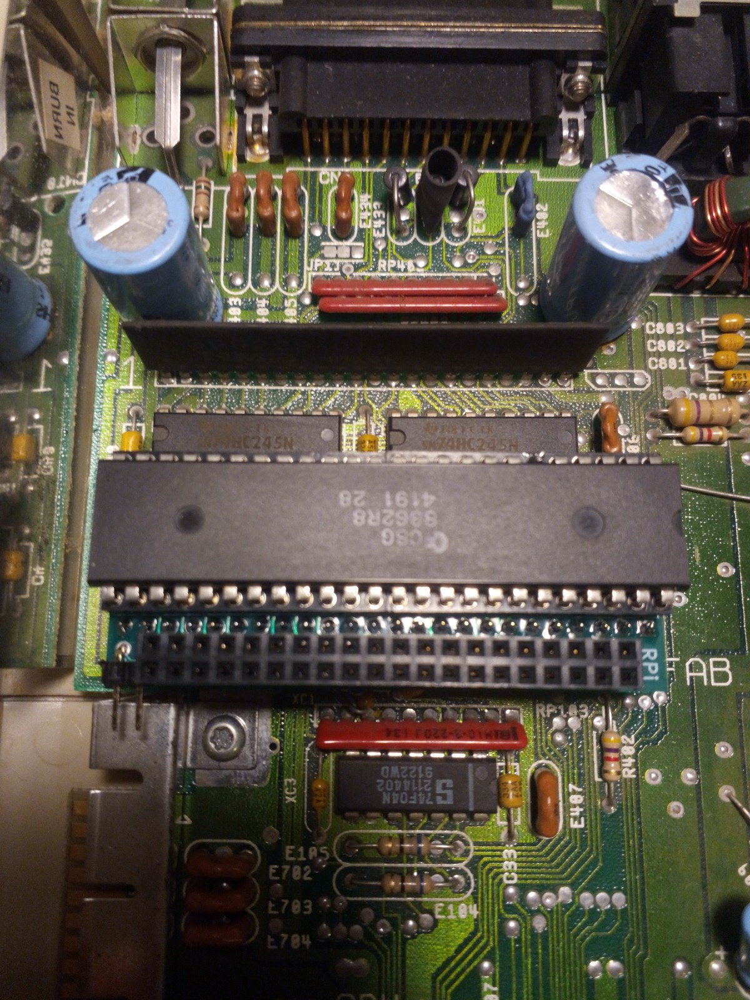
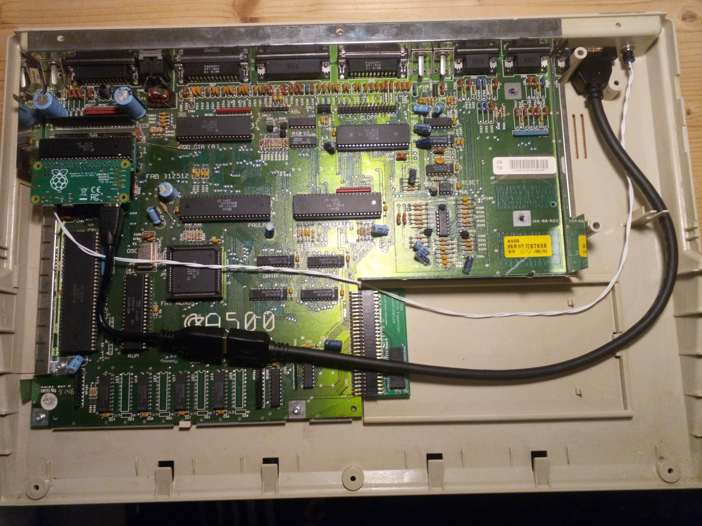

# Amiga-Digital-Video
Add pixel-perfect HDMI output to the Amiga machines.

For all Amiga versions that have a socketed Denise chip, a rather small adapter board can
be used to extract the digital video signal (12 bit) to a 40-pin connector compatible
with the a Raspberry Pi Zero. This can then be used with the RGBtoHDMI software 
to produce a perfect HDMI picure with very low latency (a few milliseconds at most).

## Stuff needed

The only hardware needed that can not be bought off-the-shelf is a small adapter board that goes
under the Denise chip.

The rest can be directly bought from any electronics retailer:
* Raspberry Pi Zero (any variant)
* Micro SD card (any)
* Mini-HDMI adapter or adapter cable (may already come in a set with the Pi)
* Some HDMI extension to reach the outside of the computer case

An optional push button can be added to allow changing of output resolutions and other tweaks.
If 1080p is OK for you, this is not needed. 

## Build process

1. Remove Denise graphics chip

2. Insert adapter with Denise on top

3. Attach Raspberry Pi Zero upside down and attach HDMI and button cable (optional)

4. Bring cables to the outside of the case

## Software

Download the latest release of the RGBtoHDMI software (https://github.com/hoglet67/RGBtoHDMI) and unzip the content to the micro SD card 
(must be formatted as FAT32). This micro SD card goes into the RPi and contains all software needed.
Because the adapter board contains a configuration selector, the Amiga profile is already preselected and can be used directly.

