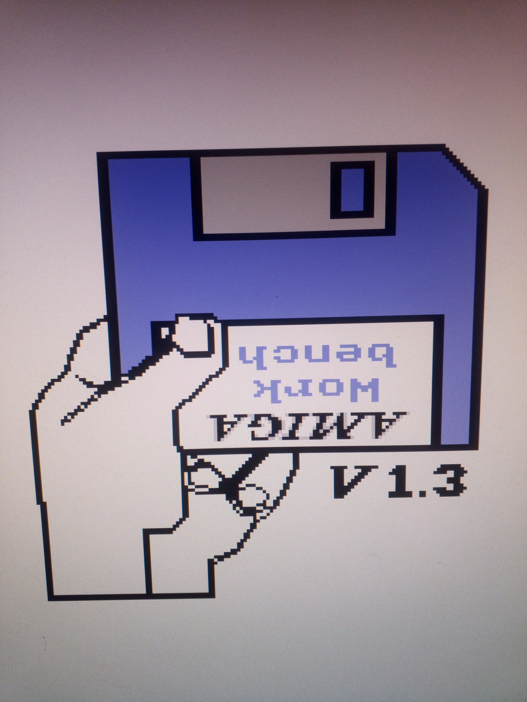

# Amiga-Digital-Video
Add pixel-perfect HDMI output to the Amiga machines.

For all Amiga versions that produce a 12-bit color video signal, this signal can be convert to pixel-perfect
HDMI using the [RGBtoHDMI](https://github.com/hoglet67/RGBtoHDMI) system. There are now quite some different
ways available to wire this all together.

This page tries to give a short overview over the possibilities and instructions on some of the options.
Also the issue tracking system can be nicely used as discussion forum for everything related.

## Internal solutions

The most compact options are to put everything into the Amiga case itself, exposing just an HDMI output port.
Adding this HDMI port may or may not be a problem depending on the exact Amiga variant and 
if you intend to keep your case in original condition. 

### Direct adapter

This solution uses an [adapter board](direct_adapter) containing some standard logic ICs
that goes between the Denise and its socket. A Raspberry Pi Zero is direct attached to this board.

### CPLD adapter

A very similar solution to the dirct adapter interfaces the Denise to the Raspbery Pi using a CPLD. This
can be used to more finely tune the sampling.

### Big-box video interfaces

For Amiga 2000s and other machines with a dedicated video socket, there is a nice option that 
can be easily installed and also solves the problem of the HDMI output port quite naturally. 

For one example check https://github.com/Bloodmosher/Amiga-VideoSlot-RGBtoHDMI

### PLCC pickup board

The Denise chip in the Amiga 600 has a different form factor and requires a specialized 
adapter solution. There are some designs available, utilizing a PLCC socket that can be 
attached to the Denise without soldering. 

### Small adapter for Amiga 600

A very cheap solution is a [small board](small_adapter) that needs to be soldered to
the different signals manually. 

## External solutions

If you prefer, you can use an external RGBtoHDMI device to do the upscaling. This 
solution has the advantage that you can use the RGBtoHDMI for other machines when needed. 
The RGBtoHDMI is connected with a 16-way ribbon-cable that also carries power from the Amiga, so no
extra power supply is needed.

### Denise pickup board

A fairly simple adapter board to go between the Denise and its socket can pick up all
digital signals and transport them via a ribbon cable out of the computer case.
Again this requires some hole in the case or other way to get the cable out. Otherwise
the installation is relatively easy.

### Digital output on the DB23

This requires modification of the Amiga video circuitry. Re-purposing some 
lesser used pins on the DB23 video connector can bring all relevant signals to the 
outside without modifying the computer case. 
This hack requires soldering skills, but no special hardware.

Check the [Amiga digital video hack](db23_hack) for details.  

## Contact

For general questions on the project and to reoport problems and give feedback, please use the github issue system.
For specific questions, like ordering kits for the "Small" adapter, please email me at   reinhard.grafl (at) aon.at .
