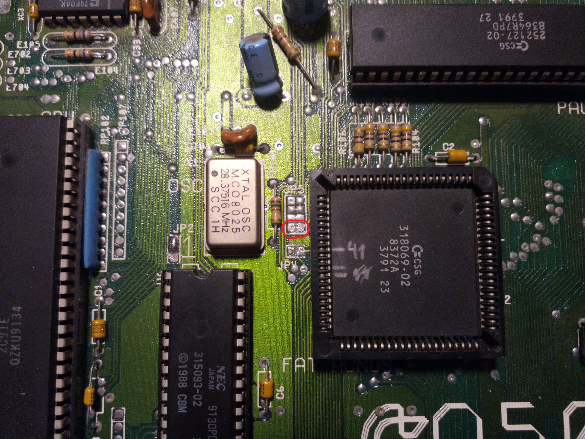
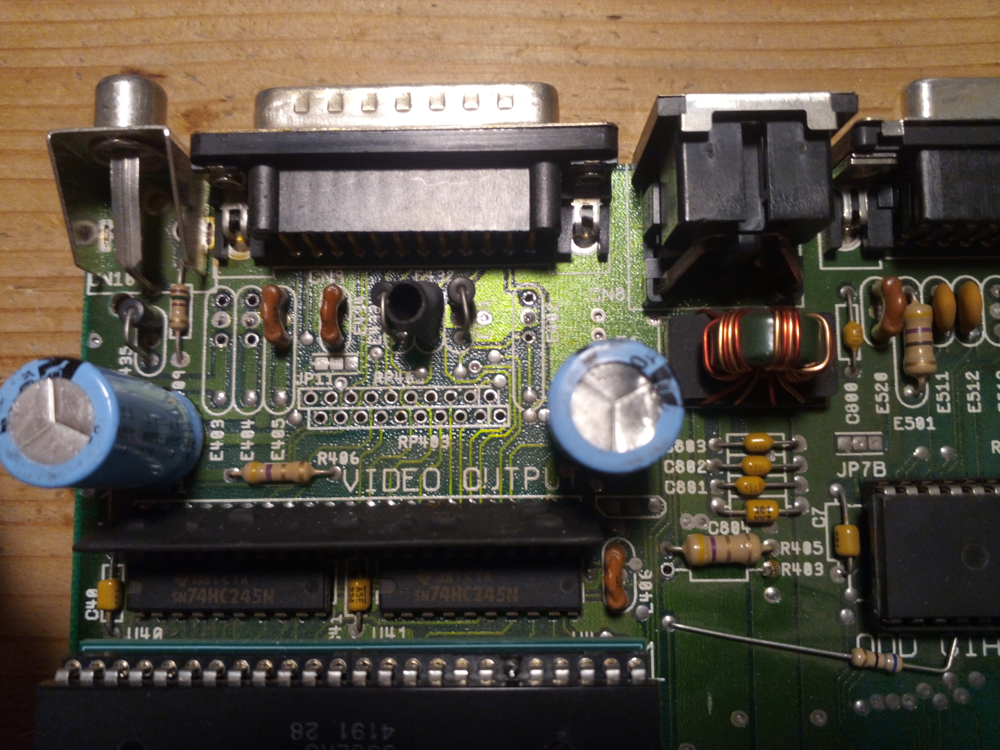
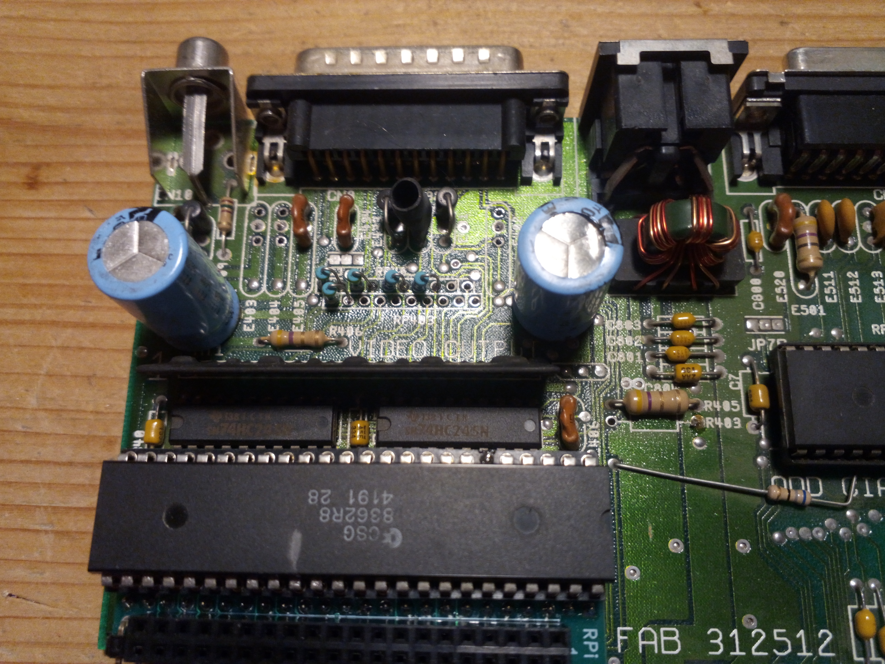
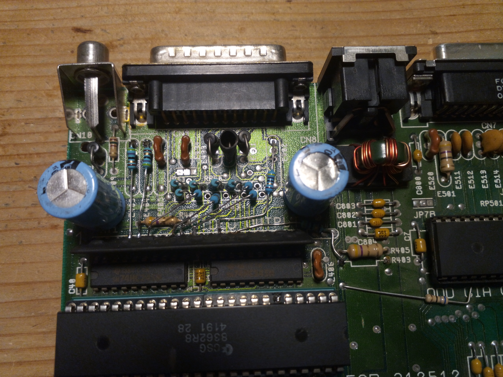

# Amiga Digital Video Hack

The standard video connector of the Amiga has 23 pins of which only a small number
is actually needed for most use cases. When re-purposing 8 of the lesser used
pins, all 12 color bits can be exposed. 

These signals can then be used to feed into an upscaler like the RGBtoHDMI to generate
perfect HDMI.

## Modified video pinout

| Pin    | Original      | Modified
| ------ | ------------- | -------------------
| 1      | XCLK          | G0
| 2      | _XCLKEN       | B1
| 3      | R analog      |
| 4      | G analog      |
| 5      | B analog      |
| 6      | DI = B0       |
| 7      | DB = B3       |
| 8      | DG = G3       |
| 9      | DR = R3       |
| 10     | CSYNC         |
| 11     | HSYNC         | G2
| 12     | VSYNC         | R0
| 13     | DGND          |
| 14     | PIXLSW        | G1
| 15     | _CCK          | B2
| 16     | GND           |
| 17     | GND           |
| 18     | GND           |
| 19     | GND           |
| 20     | GND           |
| 21     | -5/-12 volt   | R2
| 22     | +12 volt      | R1
| 23     | +5  volt      |

## Incompatibilities

I have tried to keep compatibility with existing display devices as high as possible, but some things
will just no longer work.

* Genlock interface: 
The _XCLKEN und XCLK inputs were used to force the Amiga's clock to run in sync with an external hardware. This was 
used to produce overlays for TV video signals. Also the PIXLSW output was used for this purpose to notify the
overlay circuity about when the Amiga is creating any color signal.
* CGA or VGA monitors:
Monitors that need explicit horizontal and vertical sync signals (HSYNC, VSYNC). Originally this, together with the 4 original digital 
color outputs, was intended to drive a CGA monitor. Later hacks used this to connect a 15kHz-compatible VGA monitor. 
* Clock output:
I don't know which hardware actually used the clock output (_CCK), but anyway it would not work any longer.
* -5/-12 volt:
I also don't know which hardware would need the negative voltage. So whatever the usage was, it will not work.
* SCART adapters:
This is the only real use case that is probably still relevant. Many Amiga-to-SCART cables use the +12 volt output
to generate the signal to auto-select the SCART input to be shown on the TV. I am not sure what the 
TV will do if this signal now is a randomly toggling input. In the best case you only need to select the 
SCART input manually. In the worst case the TV will be too confused to work. In this case you need to 
rewire the SCART adapter to use the 5V instead of the 12V for this signaling.

## Doing the modifications

My instructions and pictures refer to my Amiga 500 board that is Revision 6A. The circuit of other machines may be similar
but may also differ in important aspects. Do not follow this instructions blindly but use your own judgement.

You will need soldering/desoldering equipment, 13 resistors (47 Ohm) and some soldering skills.

### Cut _XCLKEN

The input connection from pin 2 to the Agnus chip is routed through the jumper pad JP5. There you need to
cut the bottom-most jumper link.

### Remove original parts

Remove all parts that are connected to the traces going to the pins which need to
receive a different signal:

* Resistor pack RP402
* Resistor pack RP403
* Resistor R403
* EMI filter E402
* EMI filter E403
* EMI filter E404

### Replace resistors of unchanged signals

5 signals were already at the correct output pins and would not have needed any 
modification. But because they use parts of the resistor packs that do need to be removed, you now need
to re-install individual 47 Ohm resistors for them.

As shown in the picture, you need to connect pins 9&10 of RP403 as well as pins 3&4, 5&6, 7&8 and 9&10 of RP402
with one resistor each.

### Wire up new signals

The 8 color signals can be best taken from the pins of the "video hybrid" and fed via 47 Ohm resistors 
into the various soldering holes in the PCB where the removed parts were.

Use this table for detailed instructions.

| Signal | Video Hybrid pin  | to
| ------ | ----------------- | -------------
| R2     | 4                 | E403 pin 1
| R1     | 5                 | E404 pin 1
| R0     | 6                 | RP403 pin 8
| G2     | 9                 | RP403 pin 6
| G1     | 10                | RP402 pin 2
| G0     | 11                | RP403 pin 2
| B2     | 14                | E402 pin 1
| B1     | 15                | R403 pin 2

## Connector to the RGBtoHDMI

With the internal modification finished, you need a cable to properly connect the Amiga to the RGBtoHDMI. This is 
pretty straight forward when using a ribbon cable, a 16-pin IDC connector and a female 23-pin D-Sub connector (a.k.a. DB23).
For some time now, there are even some properly made DB23 connectors available, so you don't need to cut down a DB25: 
(https://retrohax.net/shop/modulesandparts/db23-connector-female/)

Important safety notice:
Using this cable on an unmodified Amiga will directly transfer the original -5/-12 and +12 volts into the RGBtoHDMI which
will damage the CPLD and maybe even the Raspberry Pi itself. Consider to write a warning on the DB23 plug.

| Signal  | 16 way IDC | DB23
| ------- | ---------- | ----
| G0      | 1          | 1
| R0      | 2          | 12
| B0      | 3          | 6
| G1      | 4          | 14
| R1      | 5          | 22
| B1      | 6          | 2
| GND     | 7          | 16
| G2      | 8          | 11
| R2      | 9          | 21
| B2      | 10         | 15
| R3      | 11         | 9
| CSYNC   | 12 (HSYNC) | 10
| G3      | 13         | 8
| GND     | 14 (VSYNC) | 17
| B3      | 15         | 7
| +5V     | 16         | 23
