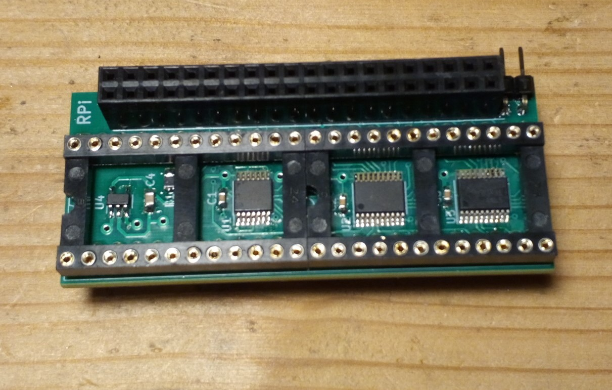

# Direct denise adapter

For all Amiga versions that have a socketed DIP Denise chip and the required physical space inside, 
a rather small adapter board can be used to extract the digital video signal (12 bit) to a 40-pin connector compatible
with the Raspberry Pi Zero. This can then be used with the [RGBtoHDMI](https://github.com/hoglet67/RGBtoHDMI) software 
to produce a perfect HDMI picture with very low latency (a few milliseconds at most).

## Stuff needed

The only hardware needed that can not be bought off-the-shelf is a small adapter board that goes
under the Denise chip.

The rest can be directly bought from many electronics retailers:
* Raspberry Pi Zero (any variant)
* Micro SD card (any) and some means to transfer data to it.
* Mini-HDMI adapter or adapter cable (may already come in a set with the Pi)
* Some HDMI extension to reach the outside of the computer case

An optional push button can be added to allow forcing of specific output resolutions and other tweaks.
As the device auto-detects the monitor resolution and produces the best possible picture anyway,
this is normally not needed.

## Software

The Raspberry Pi needs to have a version of the RGBtoHDMI software on its SDCard. A compatible release of the 
software is available from the RGBtoHDMI repository 
https://github.com/hoglet67/RGBtoHDMI/releases.
Unzip the content of the archive to the root folder of a micro SD card, formatted as FAT32. 
This card goes into the Rasperry Pi Zero and contains all software needed. 
Because the adapter board contains a configuration selector, the Amiga profile is already preselected and can be used directly.

## Installation - no soldering required

When you are not comfortable with a soldering iron or just don't have one, you can easily
obtain a Rasperry Pi Zero with preinstalled pin headers from various vendors. 
When you use this and don't require the optional menu button (for expert use only), the whole
installation is just done by plugging parts together. 
Depending on how you want to bring the HDMI signal out of the computer case, you may have to 
cut a hole in the case. Or to keep the case original, you could also bring the
cable out through some other opening (like the expansion port), or just do not close the case at all.

[Step by step installation instructions](installation/README.md)

There is also a nice Youtube video series from a user showing the installation process in more detail:
https://www.youtube.com/user/brostenen

## Compatibility

The first revision of the adapter board works with PAL and NTSC Amigas that have an OCS Denise 
(8362 variants).The current version of the board (V2) also supports a DIP-48 8373 SuperDenise
(sorry, Amiga 600 users), but only as long as one of the OCS screen modes is used
(320x256, 320x512 interlaced, 640x256, 640x512 interlaced).

For very early models of the A500 and A2000 as well as all the A1000 models, some additional
soldering to the main board is needed to bring the necessary signals to the Denise socket.
Refer to https://github.com/c0pperdragon/Amiga-Digital-Video/issues/28 for more details on how this can be done.

Please note that the HDMI signal will not carry any audio. You still need to get the audio signal from
the RCA jacks as usual. If you absolutely have to merge the audio signal into HDMI there are
dedicated [external solutions](https://www.reichelt.at/at/en/hdmi-4k2k-audio-inserter-converter-ida-hdmi-ai4k-p247886.html?r=1)
for that.

The output device needs to support at least 1024 lines because the mod quadruples the screen resolution. So 
I very much guess an early 720p TV will not work at all. Digital computer monitors normally already have a sufficiently 
high resolution.
Also some monitors may refuse to work with a video signal with 50 frames per second as produced by the PAL Amiga variants.
In such a case you can force the upscaler to 60 frames per second mode by pressing the menu button during power-up.
If you have not installed the button, you can as well just semi-permanently put a jumper link on the button contacts
instead.
When you force 60 frames in such a way, you will experience screen-tearing or jumpy scrolling in games or demos, 
so this fall-back should only be used if it would not work at all otherwise.
