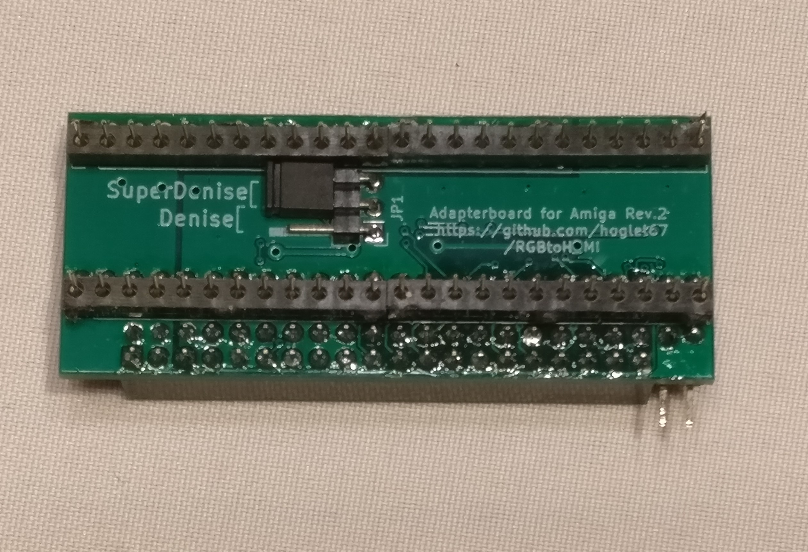
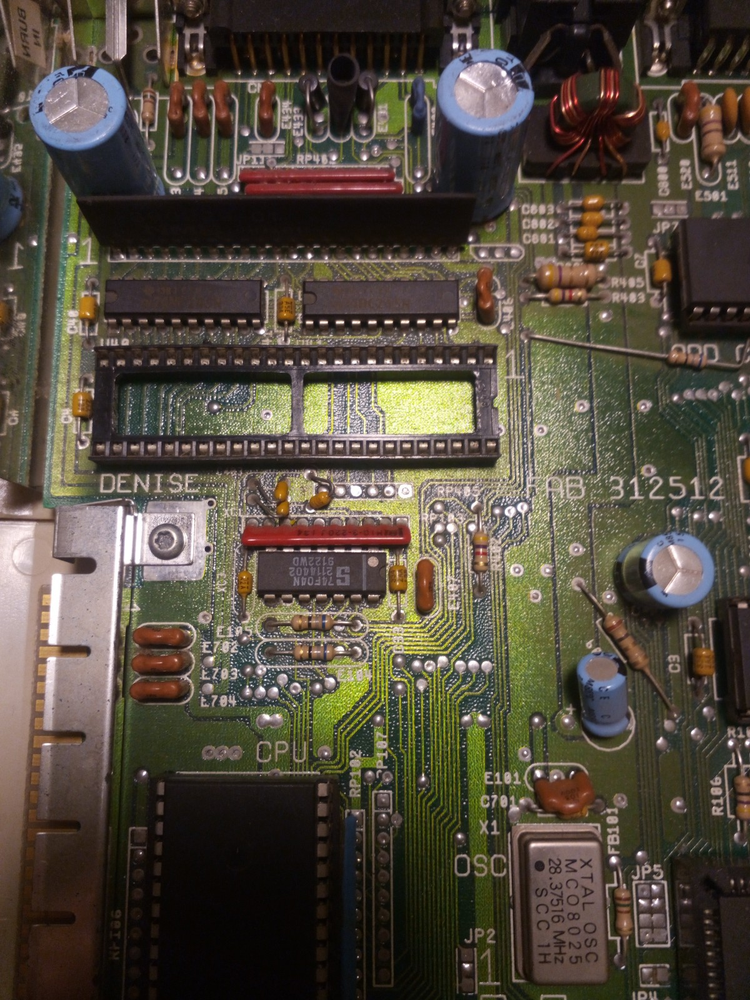
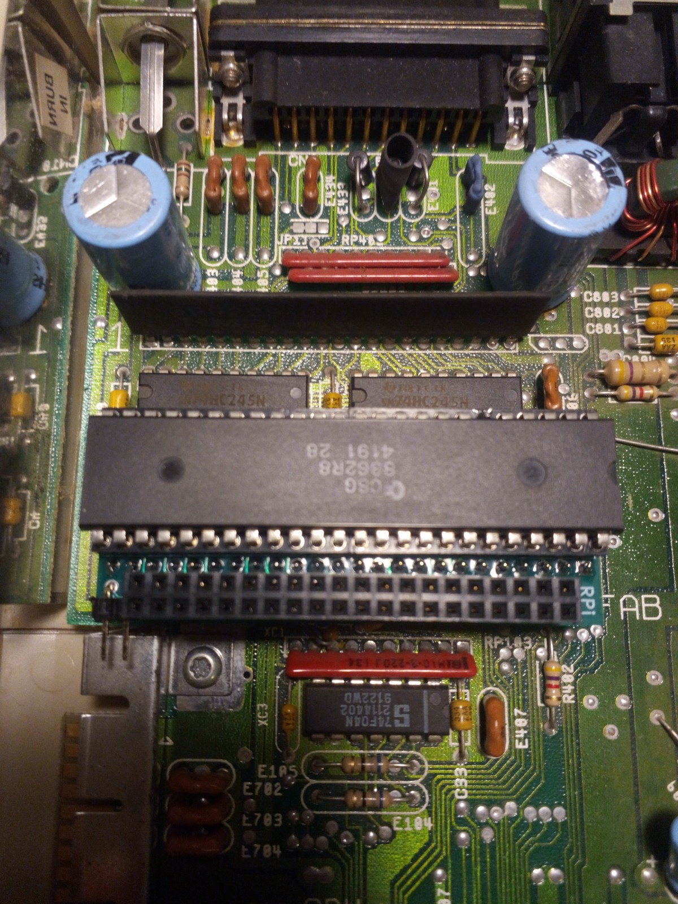
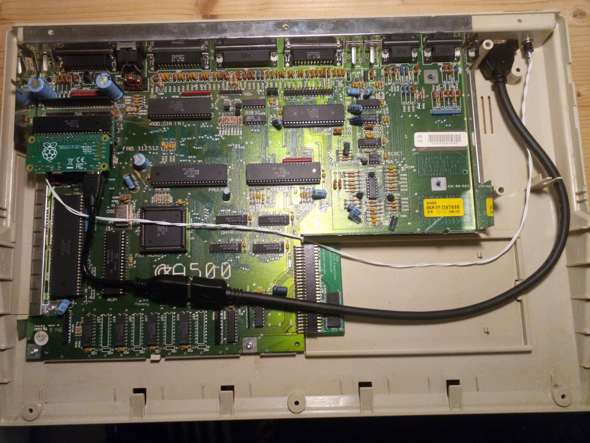

# Installation process

1. Insert the MicroSDcard with the RGBtoHDMI software into the Raspberry Pi Zero.

2. Check/set the jumper on the underside of the adapter to select the correct Denise variant.

3. Remove Denise graphics chip from Amiga 

4. Insert adapter with Denise on top

5. Attach Raspberry Pi Zero upside down and attach HDMI and button cable (optional)

6. Bring cables to the outside of the case

