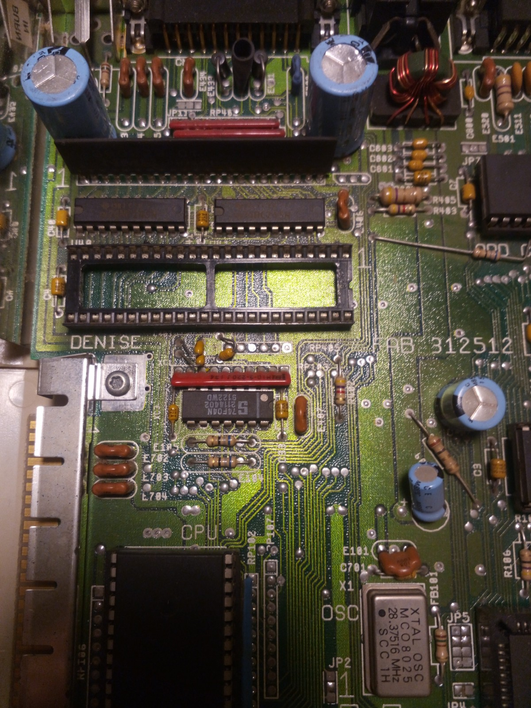

# Installation process

1. Insert the MicroSDcard with the RGBtoHDMI software into the Raspberry Pi Zero.

2. Remove Denise graphics chip

3. Insert adapter with Denise on top

4. Attach Raspberry Pi Zero upside down and attach HDMI and button cable (optional)

5. Bring cables to the outside of the case

