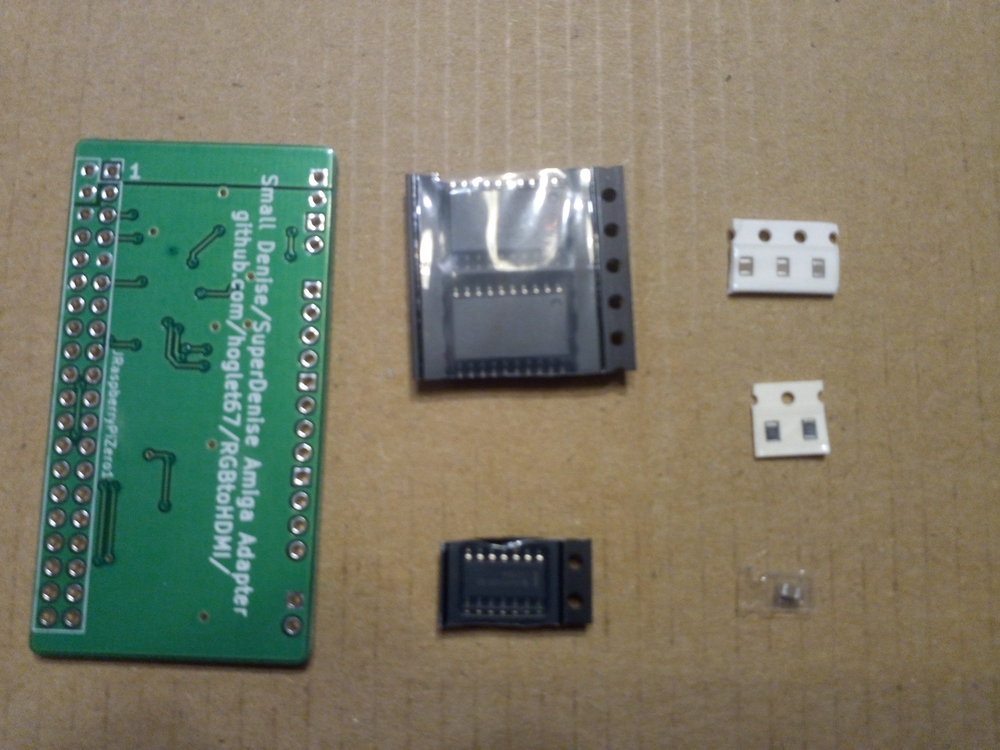

# Small adapter 

I can provide a very cheap DIY solution for the adapter. This consists of a PCB and the necessary SMD parts.
You will have to solder this yourself and also add individual wires to various points on the Amiga main board.
Doing the SMD is not too hard, as I have explicitely chosen the largest SMD parts available (1.25mm pin pitch). If you are new to SMD, there are many
good tutorials available on youtube, like for example https://www.youtube.com/watch?v=hoLf8gvvXXU .

## Kit content

To be able to send it in a simple envelope, only the SMD parts are included. If you want to make the board detachable from the Pi,
you also need to get a female 40-pin connector.

There are basically the PCB, the ICs and the passives. It is easy to see which ICs go where - just make sure get the orientation correct 
(pin 1 is marked on the board as well as on the ICs themselves).
C1, C2, C3 are the 100nF capacitors in the strip with 3 parts.
R1, R2 are 3k3 resistors in the strip with 2 parts.
C4 is a 1uF capacitor in the transparent strip all on its own.

## Installation

After soldering all the parts to the board, connect the board on top of the Raspberry Pi zero. The cheapest possible way is to just stick the board onto 
the GPIO pins of the Pi and solder it in place (make sure to leave a bit of space in between to allow heat dissipation). For a detachable solution,
you can also a female 40-pin header to the underside of the adapter board first. 

After that find some convenient position in your Amiga and mount the Pi together with the adapter board with whatever means is convenient to you. 
Then wire up all the input signals to the proper positions on your main board.
The locations from where to get the signals are depending on type of the machine and the board revision. There is a quite active community already discussing this topics 
in various issue threads. The Amiga 600 installation is specifically handled in  https://github.com/c0pperdragon/Amiga-Digital-Video/issues/22

The rest of the installation and operation works like for the standard Denise adapter. 
